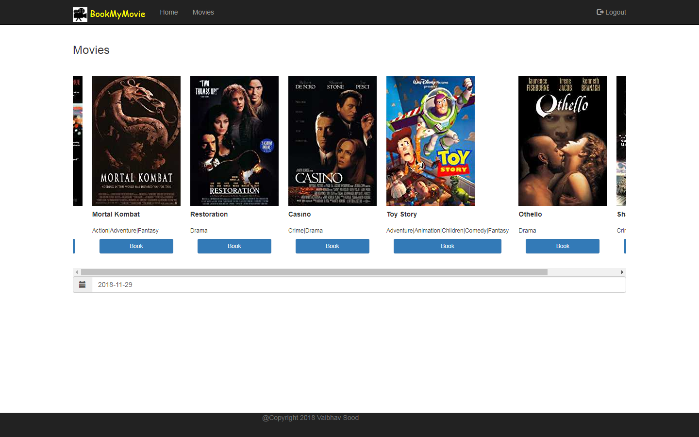

[](https://travis-ci.org/vaibhavsood/BookMyMovie)
# BookMyMovie
This is a simple movie ticket booking application using Spring Boot, Spring Security and HTML/CSS/Bootstrap for the frontend. 

It uses the [MovieLens dataset (small)](http://files.grouplens.org/datasets/movielens/) to populate movie info  




## Running BookMyMovie locally

BookMyMovie is a [Spring Boot](https://spring.io/guides/gs/spring-boot) application built using [Maven](https://spring.io/guides/gs/maven/). It can be run either from the command line or through an IDE or as a docker image

### Prerequisites

* Java 8+
* git command line tool (https://help.github.com/articles/set-up-git)
* Maven
* Your prefered IDE (optional but recommended, i use Intellij) 

### Steps:

1) Clone the project from git
```
git clone https://github.com/vaibhavsood/BookMyMovie.git
```
2a) To run from the command line:
```
cd BookMyMovie
./mvnw package
java -jar target/*.jar
```
or run it directly from Maven using the Spring Boot Maven plugin
```
cd BookMyMovie
./mvnw spring-boot:run
```
2b) To run using an IDE (Intellij):
From the main menu, choose ```File->Open``` and navigate to the BookMyMovie folder cloned from step 1
Right click ```ReservationsApplication``` class file and choose Run

The application can then be accessed by pointing your browser to http://localhost:8080/movies

2c) The application can also be run as a docker image. To run as a docker image (docker needs to be preinstalled):
```
cd BookMyMovie
docker build -t bookmymovie
docker run -p 8080:8080 -d bookmymovie
```
Note: A prebuilt docker image is available at https://hub.docker.com/r/vaibhavsood/bookmymovie/

## Contributing

This is intended to be a learning project so please feel free to fork this repo or suggest improvements!
